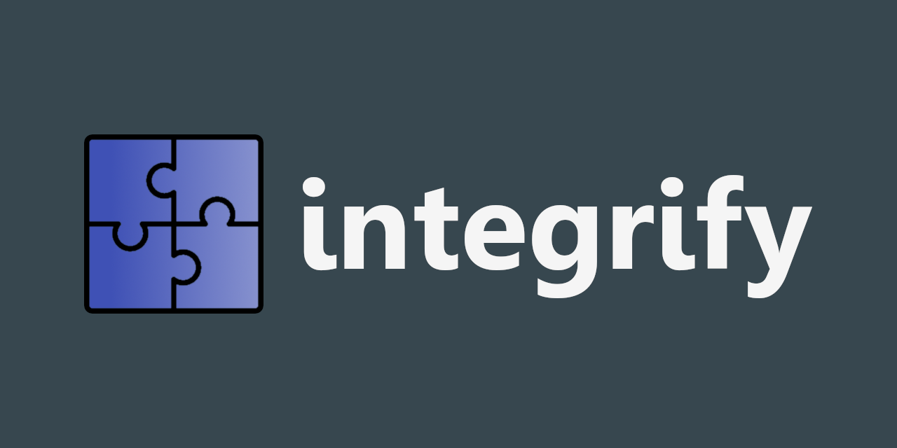

# Integrify
Infrastructure layer between ERP systems and e-commerce systems. Can be use for synchronization orders, customers, products and stock form the connected systems.

> [!NOTE]  
> Project is participating in the [100commitow](https://100commitow.pl/ "100commitow.pl") competition.

## 03/2024
- [x] prepare concept schema
- [x] create bootstapper project
- [x] create shared layer
- [x] create first simple module
- [x] create all abstracions needed for modular monolith
## 04/2024
- [ ] impementation of Order module
- [ ] impementation of Product module
- [ ] impementation of Stock module
- [ ] impementation of Customer module
## 05/2024
- [ ] create first ERP plugin
- [ ] create first E-commerce plugin
- [ ] create CLI for management integration process
## 06/2024
- [ ] create documentation website
- [ ] adjust readme file with instrucion how to run

# Core features
- [ ] Orders synchronization
- [ ] Customers synchronization
- [ ] Products synchronization 
- [ ] Stock status synchronization
- [ ] Creating orders documents (receipt/invoice)
- [ ] Logging of synchronization process
- [ ] Synchronization time scheduling
- [ ] Synchronization direction management (Shop <-> ERP) 

# Nice to have features
- [ ] CLI for management synchronization
- [ ] GUI for preview synchronization process

# Concept

# Tech Stack
 - .NET 8
 - Docker
 - PostgreSQL (maybe)

# Architecture
> **Modular Monolith architecture** because it is important to separate business logic to a separated modules. Synchronization process should not be dependent on erp/ecommerce system.

# License

🫥🫥🫥🏐🏖️