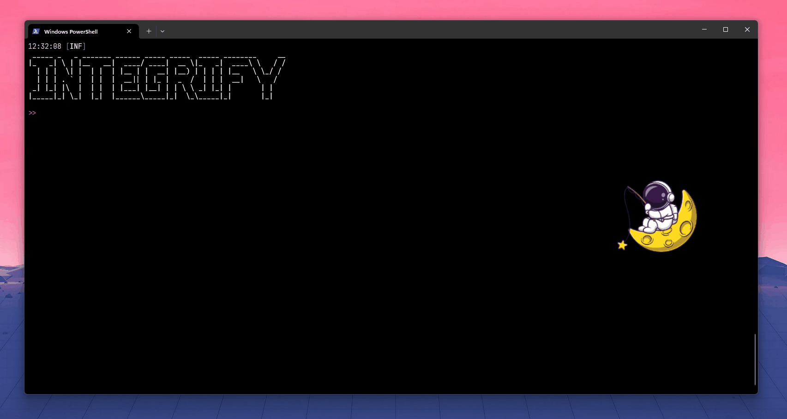

# Overview ✨ 
**Integrify** is an infrastructure tool that enables the creation of integration processes between e-commerce systems, such as stores, and ERP systems. It provides infrastructure based on several areas of integration:
* Customers,
* Orders,
* Products,
* Stocks.

In the integration process, external plugins are used as adapters for external e-commerce systems. The plugins provide data to the integration area, and after the integration process is complete, they transmit the data to another area.

# Motivation 🔮
The motivation to create this tool was born a few years ago when I was working as a .NET developer in the integration area team. I noticed a problem in creating custom integrations between e-commerce systems, which was the lack of a single infrastructure layer between the store and the ERP system. Each integration with an external e-commerce system required a significant amount of work to rebuild the application. 

The creation of the Integrify tool is intended to help solve the above problem to some extent. The application has been designed to separate the integration processes of areas from the implementation of integration with external e-commerce systems.

# Features 🎁

* CLI for management integration process
* Integration of **Customers** area
* Integration of **Orders** area
* Integration of **Products** area
* Integration of **Stocks** area
* Integration models for each area
* Plugins for integrate with e-commerce systems
* Easy to extend and maintenance

# How to use? 💻

### CLI commands:
* `help` - displays available commands with information how to use them.
* `info` - displays information about loaded plugins and integration areas.
* `sync` - begins integration process of specified integration area.

# Dictionary 📘

**Integration** - specified area contains integration process focuses only on integration model included in the area.

**Integration model** - shared model for ports, adapters and integration processes. 

**Integration process** - uses integration area ports and model for execute integration strategy.

**Port** - abstract interface of integration area contains methods allows to execute integration procesess

**Adapter** - implements of specified integration area port. Contains the exact implementation of integration with an external e-commerce system.

**Plugin** - provides adapters of integrations with an external e-commerce systems. Defines which adapters will be used by ports in the integration processes.

# Feel free to fork! 🙌

..and build your own integrations using this tool as a template! All important informations you find in  [official documentation](https://mlysien.github.io/integrify/ "Integrify documentation").  Have fun!

# License
